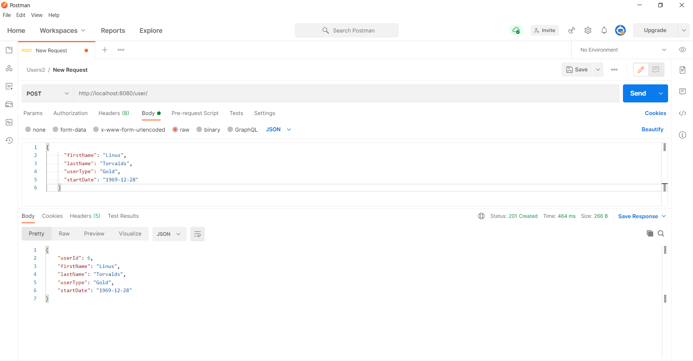
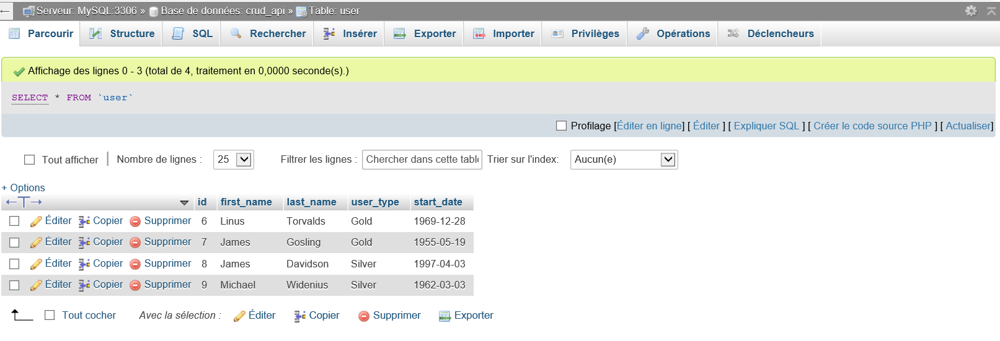
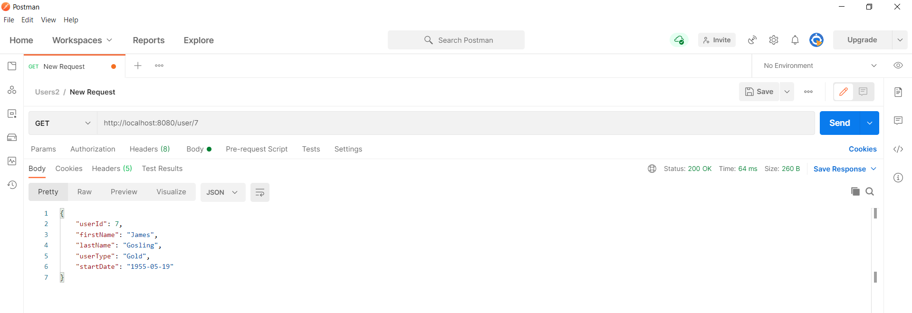
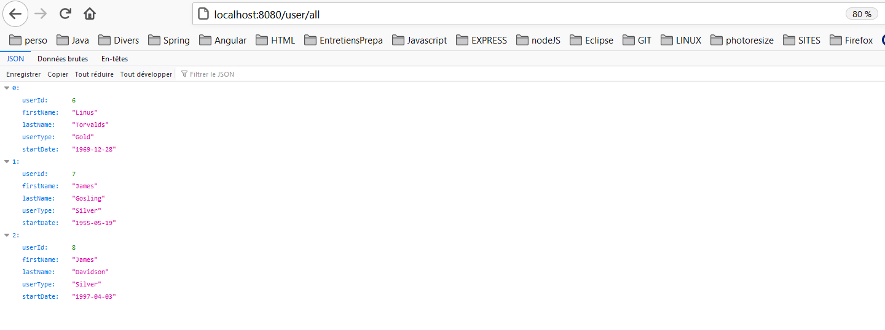

# DEMO CRUD API SPRING MySQL

## Table of Contents
1. [General Info](#general-info)
2. [Technologies](#technologies)
3. [Maven](#maven)
4. [Installation](#installation)
5. [Project Directory](#project-directory)
6. [DB Configuration](#db-configuration)
7. [User Table](#user-table)
8. [Spring Boot Application](#spring-boot-application)
9. [Testing with Postman](#testing-with-postman)
10. [REST API endpoints](#rest-api-endpoints)

# General Info
Creation d'une API REST: créer, mettre à jour et supprimer des enregistrements utilisateur.

# Technologies
* O.S. Windows 10
* Java 1.8
* Spring Boot 2.4.4
* Maven 4.0.0

# Maven 
Creation Maven [Spring Boot Initializr](https://start.spring.io/)

>Dependecies:
* Spring Data JPA
* Spring Web
* Spring Boot DevTools
* MySQL Driver

# Installation
* git clone https://github.com/ioanamatac/spring_boot_rest_api_crud.git
* cd project
* maven install 

# Project Directory


# DB Configuration

Spring boot lit par default le fichier de propriétés à partir de cet emplacement src / main / resources / application.properties.
Le fichier application.properties :

```spring.datasource.driverClassName = com.mysql.jdbc.Driver
spring.datasource.url=jdbc:mysql://localhost:3306/crud_api
spring.datasource.username=root
#change the dialect as per MySQL version (optional)
#spring.jpa.properties.hibernate.sqldialect=org.hibernate.dialect.MySQL5InnoDBDialect
spring.jpa.properties.hibernate.show_sql=true

```
# User Table
Creation de la table User.

```sql
CREATE TABLE `user` (
  `id` int(11) NOT NULL AUTO_INCREMENT,
  `first_name` varchar(45) NOT NULL,
  `last_name` varchar(45) NOT NULL,
  `user_type` varchar(15) NOT NULL,
  `start_date` date DEFAULT NULL,
  PRIMARY KEY (`id`)
) ENGINE=InnoDB AUTO_INCREMENT=6 DEFAULT CHARSET=utf8;

```

# Spring Boot Application 

Classe d'application avec la méthode principale qui est le point d'entrée de l'application Spring Boot.
>@SpringBootApplication est une annotation pratique qui ajoute les éléments:
* @ Configuration - Marque cette classe comme source de définitions de bean pour le contexte d'application.
* @EnableAutoConfiguration - Indique à Spring Boot de démarrer automatiquement la création de beans en fonction des paramètres de chemin de classe, d'autres beans et de divers paramètres de propriété.
* @ ComponentScan - Dit à Spring de rechercher d'autres composants, configurations et services dans le package de base, lui permettant de trouver les contrôleurs.

La méthode principale délègue à la classe SpringApplication de Spring Boot en appelant la méthode run. C'est la tâche de SpringApplication de démarrer l'appli, en démarrant Spring, qui, à son tour, démarre le serveur Web Tomcat auto-configuré.

# Testing with Postman

>Creer un utilisateur dans la base de données (exemple):


>Table User MySQL(tous les utilisateurs):


>Chercher l'utilisateur avec l'id n°7 (exemple) 


>Mettre à jour l'utilisateur avec l'id n°7:


>Supprimer l'utilisateur avec l'id n°9


>Table User MySQL après update & delete:


>Affichage des utilisateurs localhost:8080/user/all:


  


# REST API endpoints

HTTP Method   | URI          | Description

------------- |:------------- |:-----------

`POST`       | /user        | Save user

`GET`        | /user/{id}    | Find a user where id = {:id}

`GET`        | /user/all     | List all users

`GET`        | /user/update  | Update user

`DELETE`    | /delete/{id}  | Delete a user where id = {:id}


Enjoy !:)
Ioana
